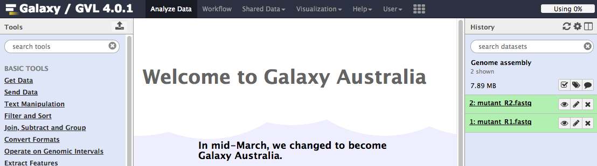

# Welcome!

*This website is currently under construction. It is not yet ready for use. Please contact anna.syme@unimelb.edu.au with questions.*

This site contains tutorials for using Galaxy Australia.

Click on the tutorial name in the left hand panel.

For new users, we recommend starting at the top of the list.

# About

Galaxy-Au information.

## Authors

## Support

* [Research Data Services](http://omics.data.edu.au/)
* [Bioplatforms Australia](http://www.bioplatforms.com/antibiotic-resistant-pathogens/)
* [Nectar](http://www.nectar.org.au/)
