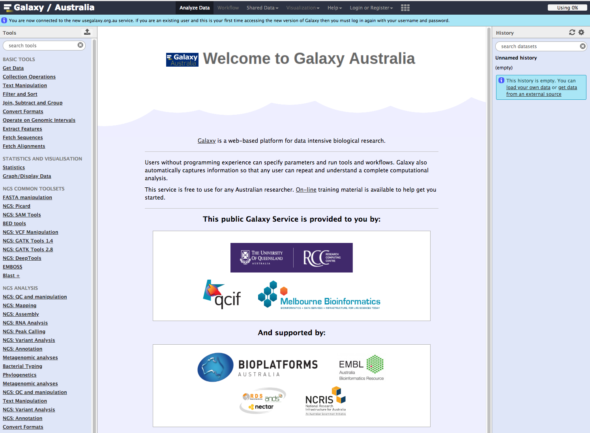
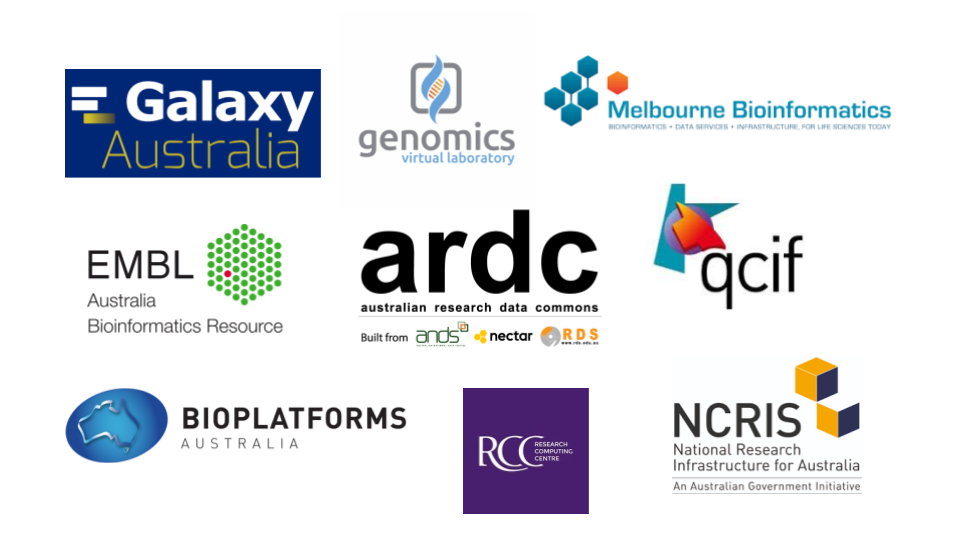

# Welcome!

## Tutorials

This site contains tutorials for using **Galaxy Australia**.

To use the tutorials:

* &#8592; see the list in the left hand panel
* &#8598; or, click the **menu button** (three horizontal bars) in the top left of the page

Web address: [www.usegalaxy.org.au](https://usegalaxy.org.au)

## Support

* Australian Research Data Commons
* National Research Infrastructure for Australia
* UQ RCC
* QCIF
* Melbourne Bioinformatics
* Bioplatforms Australia
* EMBL-ABR
