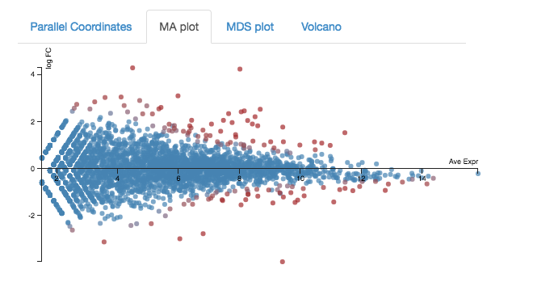
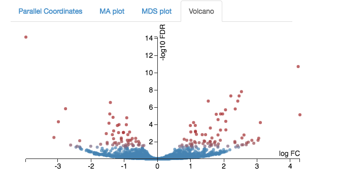

# RNA-Seq: Bacteria
This tutorial is about using RNA-seq data to investigate differential gene expression in bacteria, using Galaxy tools and Degust (a tool on the web).

<fn>**New to Galaxy?** First try the [introduction](../galaxy/index.md) and then learn some [key tasks](../intro/index.md)</fn>

<!-- **FIXME:**
- (Fastq files have been shortened to 1% using seqtk)
- Data files (Fastq reads and refs): link to swift URL? -- add correct link to the "input data" section - RNA-Seq data - and information about how to upload
-->

## Background
Differential Gene Expression (DGE) is the process of determining whether any genes were expressed at a different level between two conditions. For example, the conditions could be wildtype versus mutant, or two growth conditions. Usually multiple biological replicates are done for each condition - these are needed to separate variation within the condition from that between the conditions.

<!-- ## Learning Objectives

At the end of this tutorial you should be able to:

1. Align RNA-Seq data to a reference genome  
2. Count transcripts for each sample
3. Perform statistical analysis to obtain a list of differentially expressed genes
4. Visualize and interpret the results
-->

## Input data: reads and reference

**RNA-Seq reads**

A typical experiment will have 2 conditions each with 3 replicates, for a total of 6 samples.

- Our RNA-seq reads are from 6 samples in <fn>FASTQ</fn> format.
    - We have single-end reads; so one file per sample.
    - Data could also be paired-end reads, and there would be two files per sample.
- These have been reduced to 1% of their original size for this tutorial.
- The experiment used the bacteria *E. coli* grown in two conditions.
    - Files labelled "LB" are the wildtype
    - Files labelled "MG" have been exposed to 0.5% &alpha;MG - alpha methyglucoside (a sugar solution).

<!--
|             | Condition 1 | Condition 2 |
|-------------|-------------|-------------|
| Replicate 1 |     1       |      4      |
| Replicate 2 |     2       |      5      |
| Replicate 3 |     3       |      6      |

-->

**Reference genome**

The reference genomes is in <fn>FASTA</fn> format and the gene annotations are in <fn>GTF</fn> format.

- The <fn>FASTA</fn> file contains the DNA sequence(s) that make up the genome; e.g. the chromosome and any plasmids.
- The <fn>GTF</fn> file lists the coordinates (position) of each feature. Commonly-annotated features are genes, transcripts and protein-coding sequences.

<!--
- Where is it and how to upload. e.g. [RNA-Seq data](/rna/data.md)
- For the RNA-seq reads, change datatype to fastqsanger (not fastqCsanger)
- For the reference genome in GTF format, change datatype to GTF (not GFF)
-->

## Upload files to Galaxy

* Log in to your Galaxy instance (for example, Galaxy Australia, [usegalaxy.org.au](https://usegalaxy.org.au/)).

### Use shared data

If you are using Galaxy Australia, you can import the data from a shared data library.

In the top menu bar, go to <ss>Shared Data</ss>.

* Click on <ss>Data Libraries</ss>.
* Click on <fn>Galaxy Australia Training Material: RNA-Seq: Microbial RNA-Seq</fn>.
* Tick the boxes next to the nine files.
* Click the <ss>To History</ss> button, select *As Datasets*.
* Name a new history and click <ss>Import</ss>.
* In the top menu bar, click <ss>Analyze Data</ss>.
* [Optional] Next to each file, click on the pencil icon and change (shorten) its name.
* You should now have eight files in your current history ready for the analysis, plus an additional "JBrowse" file that we will use later.

### Or, import from the web

 *Only follow this step if unable to load the data files from shared data, as described above. Click here to expand.* 

* In a new browser tab, go to this webpage:
* 
* For each file, right click on file name: select "copy link address"
* In Galaxy, go to <ss>Get Data</ss> and then Upload File
* Click <ss>Paste/Fetch data</ss>
* A box will appear: paste in link address
* Click <ss>Start</ss>
* Click <ss>Close</ss>
* The file will now appear in the top of your history panel.
* Repeat for all files in Zenodo.
* Change (shorten) the file names with the pencil icon.

<!--

    https://zenodo.org/record/1311269/files/E_coli_aMG1.fastq?download=1
    https://zenodo.org/record/1311269/files/E_coli_aMG2.fastq?download=1
    https://zenodo.org/record/1311269/files/E_coli_aMG3.fastq?download=1
    https://zenodo.org/record/1311269/files/E_coli_Lb1.fastq?download=1
    https://zenodo.org/record/1311269/files/E_coli_Lb2.fastq?download=1
    https://zenodo.org/record/1311269/files/E_coli_Lb3.fastq?download=1
    https://zenodo.org/record/1311269/files/Ecoli_k12.fasta?download=1
    https://zenodo.org/record/1311269/files/Ecoli_k12.gtf?download=1

-->

<!--

- Log in to your Galaxy server, e.g. Galaxy Australia (usegalaxy.org.au).
- In the <ss>History</ss> pane, click on the cogicon, and select <ss>Import from File</ss> (at the bottom of the list).
- Under <ss>Archived History URL</ss> paste:
<tt>https://swift.rc.nectar.org.au:8888/v1/AUTH_377/public/Microbial_tutorials/Galaxy-History-BacterialDGE.tar.gz</tt>
- In the <ss>History</ss> pane, click on the viewicon and find the uploaded history.
    - (This may take a minute. Refresh the page.)
- Click <ss>Switch to</ss> that history, then <ss>Done</ss>.
-->

### Convert the GTF file

In the tool panel, search for "GTF".

- Click on <ss>GTF-to-GFF</ss> converter
- select the <fn>Ecoli_k12.gtf</fn> file
- Click <ss>Execute</ss>

This will produce a convereted reference genome file that we need in a different format for downstream analyses.

Re-name the output file with the pencil icon, e.g. to <fn>Ecoli_k12.gff</fn>.

## Align reads to reference

The RNA-Seq reads are fragmented and are not complete transcripts. To determine the transcripts from which the reads originated (and therefore, to which gene they correspond) we can map them to a reference genome.

In Galaxy:

- In the <ss>Tools</ss> panel, search for <ss>Map with BWA-MEM</ss> and click on it.
- Under <ss>Will you select a reference genome from your history or use a built-in index?</ss>: *Use a genome from history and build index*
- <ss>Use the following dataset as the reference sequence</ss>: <fn>Ecoli_k12.fasta</fn>
- <ss>Single or Paired-end reads</ss>: *single*
- <ss>Select fastq dataset</ss>:
    - Click on the <ss>Multiple Datasets</ss> icon in centre
    - Select all 6 <fn>FASTQ</fn> files (they turn blue; use side-scroll bar to check all have been selected)
    - This will map each set of reads to the reference genome

Your tool interface should look like this:

- Click <ss>Execute</ss>
- Click <ss>Refresh</ss> in the history pane to see if the analysis has finished.
- Output: 6 <fn>bam</fn> files of reads mapped to the reference genome.

- Re-name the output files:
    - These are called <fn>Map with BWA-MEM on data x and data x</fn>.
    - The x will refer to the numbered file that Galaxy used in the analysis.
    - Click on the pencil icon next to each of these and re-name them as their sample name, e.g. <fn>LB1.bam</fn>, <fn>LB2.bam</fn> etc.

## View the mapped reads

In the tool panel, search for the tool "JBrowse" and click on <ss>JBrowse Genome Browser</ss>.

- Under <ss>Reference genome to display</ss> choose *Use a genome from history*.

- Under <ss>Select the reference genome</ss> choose <fn>Ecoli_k12.fasta</fn>.

- For <ss>Produce a Standalone Instance</ss> select *Yes*.

- For <ss>Genetic Code</ss> choose *11: The Bacterial, Archaeal and Plant Plastid Code*.

- We will now set up several different "tracks" - these are datasets displayed underneath the reference sequence (which is displayed as nucleotides in FASTA format). We will choose to display the mapped reads from one of each of the experimental conditions, and the annotated reference genome.

*Track 1 - mapped RNA-seq reads*

- Click <ss>Insert Track Group</ss>
- For <ss>Track Cateogry</ss> name it "RNA-seq reads"
- Click <ss>Insert Annotation Track</ss>
- For <ss>Track Type</ss> choose *BAM Pileups*
- For <ss>BAM Track Data</ss> select <fn>LB1.bam</fn> and <fn>MG1.bam</fn> (Your files may be named differently)
- For <ss>Autogenerate SNP Track</ss> select *Yes*

*Track 2 - annotated reference*

- Click <ss>Insert Track Group</ss> again
- For <ss> Track Category</ss> name it "annotated reference"
- Click <ss>Insert Annotation Track</ss>
- For <ss>Track Type</ss> choose *GFF/GFF3/BED/GBK Features*
- For <ss>Track Data</ss> select <fn>Ecoli_k12.gff</fn> *Note - select the GFF not the GTF file*
 
 
- Click <ss>Execute</ss>

A new file will be created, called <fn>JBrowse on data XX and data XX - Complete</fn>.

This file may take some time to be generated. For this workshop, we downloaded a completed JBrowse file at the start, which you could look at instead (it should be the same). This is the <fn>JBrowse on data XX and data XX - Complete</fn> file; the numbers are not important.

* Click on the eye icon next to the file name. The JBrowse window will appear in the centre Galaxy panel.

- On the left, tick boxes to display the tracks

- Use the plus and minus buttons to zoom in and out.

This visualization is for us to check that the mapping of the reads worked as expected.

You may be able to see some places where more reads have mapped to a gene from one of the conditions. This suggests that the gene in that condition was more highly expressed.

However, this needs to be verified with statistical testing, which will be covered in the next parts of this tutorial.

## Count reads per gene

We now need to count how many reads overlap with particular genes. The information about gene names is from the annotations in the GTF file.

In Galaxy:

- In the <ss>Tools</ss> panel, search for <ss>count matrix</ss> and click on <ss>SAM/BAM to count matrix</ss>
    - Note: Don't select the tool called *htseq-count*. The *SAM/BAM to count matrix* also uses that tool but allows an input of multiple bam files, which is what we want.
- For <ss>Gene model (GFF) file to count reads over from your current history</ss>, select the <fn>GTF</fn> file.
- For <ss>Reads are stranded</ss> select *Yes* (box turns dark grey)
- Leave the next two settings as default
- For <ss>GTF feature type for counting reads...</ss> select *transcript*.
- For <ss>bam/sam file from your history</ss> choose the 6 <fn>bam</fn> files.

Your tool interface should look like this:

- Click <ss>Execute</ss>
- Click <ss>Refresh</ss> in the history pane to see if the analysis has finished.

### Output

- There is one output file: <fn>bams to DGE count matrix</fn>.
- Click on the file name to expand the information in the History pane.
- Click on the file icon underneath to download it to your computer for use later on in this tutorial.
- Click on the eye icon to see this file.

- Each row is a gene (or feature) and each column is a sample, with counts against each gene.
- Have a look at how the counts vary between samples, per gene. (These are quite low as we are using a cut-down data set).
- We can't just compare the counts directly; they need to be normalized before comparison, and this will be done as part of the DGE analysis in the next step.

## Test for differential expression

There are various tools available to test for differential gene expression. In today's tutorial, we will use the tool Voom (link to the paper [here]( https://genomebiology.biomedcentral.com/articles/10.1186/gb-2014-15-2-r29)).

- In the <ss>Tools</ss> panel, search for <ss>Differential_Count models</ss> (don't forget the underscore) and click on it.
    - This has options to use edgeR, DESeq, or Voom. Here we will use Voom.
- For <ss>Select an input matrix</ss> choose the <fn>count matrix</fn> file generated in the previous step.
- For <ss>Title for job outputs</ss> enter *DGE using voom*.
- For <ss>Select columns containing treatment</ss> tick boxes for the MG samples.
- For <ss>Select columns containing control</ss> tick boxes for the LB samples.
- Under <ss>Run this model using edgeR</ss> choose *Do not run edgeR*.
- Under <ss>Run the same model with DESeq2 and compare findings</ss> choose *Do not run DESeq2*.
- Under <ss>Run the same model with Voom/limma and compare findings</ss> choose *Run VOOM*.

Your tool interface should look like this:

- Click <ss>Execute</ss>.

### Output

There are two output files. We will look at the file called <fn>DEGusingvoom_topTable_VOOM.xls</fn>.

- The <ss>Contig</ss> column shows the genes that had transcripts mapped (genes with low counts may be filtered out).
- The <ss>adj.P.Val</ss> is the statistical significance (p value) adjusted for multiple testing. The table is sorted by this column (most significant to least significant).
- The <ss>logFC</ss> is the log2 fold change, which is the change in gene expression between the treatment and control group.

We can see that the most statistically signifcant result is that the ptsG gene was expressed differently between the two conditions.

- Its expression in the treatment group was lower.
- The log base 2 change in expression is approximately -4, meaning the difference in expression is approximately 16x.

To check, let's look at the ptsG gene in the original table of counts, the <fn>bams to DGE count matrix</fn>.

- Click on the eye icon to view.
- Search for the ptsG gene (Cmd-F to search on a Mac).
- Do the read counts look different between the control samples and the treatment samples?

## DGE in Degust

Degust is a tool on the web that can analyse the counts files produced in the step above, to test for differential gene expression. (Degust can also display the results from DGE analyses performed elsewhere.)

### Upload counts file

Go to the [Degust web page](http://degust.erc.monash.edu/).

- Click <ss>Upload your counts file</ss>.
- Click on <ss>Choose File</ss>.
- Select the <fn>htseq output file. tabular</fn> (that you previously downloaded to your computer from Galaxy) and click <ss>Open</ss>. This file may have a different name, for example, it may have "Galaxy" in the title.
- Click <ss>Upload</ss>.

A Configuation page will appear.

- For <ss>Name</ss> type *DGE in E coli*
- For <ss>Info columns</ss> select *Contig*
- For <ss>Min gene read count</ss> put *10*.
- Click <ss>Add condition</ss>
    - Add a condition called "Control" and select the LB columns.
    - Add a condition called "Treament" and select the MG columns.
- <ss>Save changes</ss>
- <ss>View</ss> - this brings up the Degust viewing window.

### Overview of Degust sections

- Left: Conditions: Control and Treatment.
- Left: Method selection for DGE.
- Top centre: Plots, with options at right.
- When an expression plot is selected, a heatmap appears below.
- A table of genes (or features); expression in treatment relative to control (Treatment column); and significance (FDR column).  
- The FDR is the False Discovery Rate, also known as the adjusted p value.

### Analyze gene expression

- Under <ss>Method</ss>, make sure that <ss>Voom/Limma</ss> is selected.
- Click <ss>Apply</ss>. This runs Voom/Limma on the uploaded counts.

### MDS plot

First, look at the MDS plot.

- This is a multidimensional scaling plot which represents the variation between samples.
- Ideally:
    - All the LB samples would be close to each other
    - All the MG samples would be close to each other
    - The LB and MG groups would be far apart
- The x-axis is the dimension with the highest magnitude. The control/treatment samples should be split along this axis.
- Our LB samples are on the left and the MG samples are on the right, which means they are well separated on their major MDS dimension, which looks correct.

### Expression - MA plot
Each dot shows the change in expression in one gene.

- The average expression (over both condition and treatment samples) is represented on the x-axis.
    - Plot points should be symmetrical around the x-axis.
    - We can see that many genes are expressed at a low level, and some are highly expressed.
- The fold change is represented on the y axis.
    - If expression is significantly different between treatment and control, the dots are red. If not, they are blue. (In Degust, significant means FDR <0.05).
    - At low levels of gene expression (low values of the x axis), fold changes are less likely to be significant.

Click on the dot to see the gene name.     

### Expression - Volcano plot

 Another way to view expression levels is with the volcano plot.

- As with the MA plot, each dot is a gene.
- This time, the logFC axis is horizontal (in the MA plot, it was vertical).
- The vertical axis is a measure of statistical significance (-log10 FDR).
- If expression is significantly different between treatment and control, the dots are red. If not, they are blue. (In Degust, significant means FDR <0.05).
- This is a quick way to visualize those genes with large changes in expression (the left and right sides of the graph).  

### Expression - Parallel Coordinates and heatmap
Each line shows the change in expression in one gene, between control and treatment.

- Go to <ss>Options</ss> at the right.
    - For <ss>FDR cut-off</ss> set at 0.001.
    - This is a significance level (an adjusted p value). We will set it quite low in this example, to ensure we only examine key differences.
- Look at the Parallel Coordinates plot. There are two axes:
    - Left: **Control**: Gene expression in the control samples. All values are set at zero.
    - Right: **Treatment** Gene expression in the treatment samples, relative to expression in the control.

- The blocks of blue and red underneath the plot are called a heatmap.
    - Each block is a gene. Click on a block to see its line in the plot above.
    - Look at the row for the Treatment. Relative to the control, genes expressed more are red; genes expressed less are blue.

Note:

- for an experiment with multiple treatments, the various treatment axes can be dragged to rearrange. There is no natural order (such as a time series).

### Table of genes
- **Contig**: names of genes. Note that gene names are sometimes specific to a species, or they may be only named as a locus ID (a chromosomal location specified in the genome annotation).
- **FDR**: False Discovery Rate. This is an adjusted p value to show the significance of the difference in gene expression between two conditions. Click on column headings to sort. By default, this table is sorted by FDR.
- **Control** and **Treatment**: log2(Fold Change) of gene expression. The default display is of fold change in the treatment relative to the control. Therefore, values in the "Control" column are zero. This can be changed in the <ss>Options</ss> panel at the top right.
- In some cases, a large fold change will be meaningful but in others, even a small fold change can be important biologically.

Table of genes and expression:

<!--
A pathway is a drawn network to show interaction between molecules, including some or all of genes, proteins, RNAs, chemical reactions. E.g.
The Kegg pathway database: (Kyoto Encyclopedia of Genes and Genomes)
numbers are EC numbers - enzyme commission ->  enzyme/s that catalyze a reaction (might be >1)
-->

## Investigate differentially-expressed genes

To learn more about the differentially-expressed genes:

- Go to [the NCBI website.](http://www.ncbi.nlm.nih.gov)
- Under <ss>All Databases</ss>, click on *Gene*
- Enter the gene name in the search bar; e.g. ptsG
- Click on the first result that matches the species (e.g. in this case, *E. coli*).
    - This provides information about the gene, and may also show further references (e.g. in this case, a link to the EcoGene resource).

Some of the most (statistically) significant differentially-expressed genes in this experiment are:

- [ptsG](http://www.ncbi.nlm.nih.gov/gene/945651): a glucose-specific transporter.
- [setA](http://www.ncbi.nlm.nih.gov/gene/944793): a sugar efflux transporter; is induced by glucose-phosphate stress.
- [sucD](http://www.ncbi.nlm.nih.gov/gene/945314): the alpha subunit of the the gene for succinyl-CoA synthetase; involved in ATP production.
- [sucB](http://www.ncbi.nlm.nih.gov/gene/945307): a component of the 2-oxoglutarate dehydrogenase complex; catalyzes a step in the Krebs cycle.
- [deoC](http://www.ncbi.nlm.nih.gov/gene/948902): 2-deoxyribose-5-phosphate aldolase; binds selenium; may be involved in selenium transport.

<!-- Next steps: Investigate the biochemical pathways involving the genes of interest.-->

## See this history in Galaxy

If you want to see this Galaxy history without performing the steps above:

* Log in to Galaxy Australia: [https://usegalaxy.org.au/](https://usegalaxy.org.au/)
* Go to <ss>Shared Data</ss>
* Click <ss>Histories</ss>
* Click <fn>Published-RNA-seq-bacteria</fn>
* Click <ss>Import</ss> (at the top right corner)
* The analysis should now be showing as your current history.

## More information

Here are some references covering more information about RNA-seq.

** *A clear, up-to-date introduction to RNA-seq and testing for differential expression (pre-print):* ** Berge, K Hembach, K Soneson, C Tiberi, S Clement, L Love, M Patro, R Robinson, M. RNA sequencing data: hitchhiker’s guide to expression analysis. PeerJPreprints. Available from: http://dx.doi.org/10.7287/peerj.preprints.27283

** *Transcriptome assembly:* ** Martin JA, Wang Z. Next-generation transcriptome assembly. Nat Rev Genet. 2011 Sep 7;12(10):671–82.

** *SuperTranscripts:* ** Davidson NM, Hawkins ADK, Oshlack A. SuperTranscripts: a data driven reference for analysis and visualisation of transcriptomes. Genome Biol. 2017 Aug 4;18(1):148.

** *Splicing:* ** Alamancos GP, Agirre E, Eyras E. Methods to study splicing from high-throughput RNA sequencing data. Methods Mol Biol. 2014;1126:357–97.

** *Single-cell RNA-seq:* ** McCarthy DJ, Campbell KR, Lun ATL, Wills QF. Scater: pre-processing, quality control, normalization and visualization of single-cell RNA-seq data in R. Bioinformatics. 2017 Apr 15;33(8):1179–86.

** *Pathway analysis:* ** Khatri P, Sirota M, Butte AJ. Ten years of pathway analysis: current approaches and outstanding challenges. PLoS Comput Biol. 2012 Feb 23;8(2):e1002375.

## What's next?

To use the tutorials on this website:

* &#8592; see the list in the left hand panel
* &#8598; or, click the **menu button** (three horizontal bars) in the top left of the page

You can find more tutorials at the Galaxy Training Network:

* [http://galaxyproject.github.io/training-material/](http://galaxyproject.github.io/training-material/)
