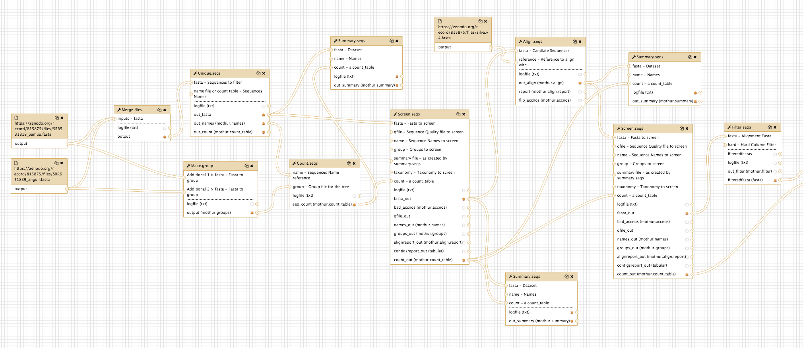

# Metagenomics in Galaxy

<fn>**New to Galaxy?** First try the [introduction](../galaxy/index.md) and then learn some [key tasks](../intro/index.md)</fn>

Metagenomics is a complicated topic but there are several tools in Galaxy that can run partial or total analyses.

The [Galaxy Training Network](https://galaxyproject.github.io/training-material/) has several excellent tutorials and background information on the topic.

We recommend starting with this tutorial that uses 16S data from two types of soil samples.

## Log in to Galaxy

* Log in to your Galaxy instance (for example, Galaxy Australia, [usegalaxy.org.au](https://usegalaxy.org.au/)).

## Use shared data

If you are using Galaxy Australia, you can import the data from a shared data library.

In the top menu bar, go to <ss>Shared Data</ss>.

* Click on <ss>Data Libraries</ss>.
* Click on <fn>Galaxy Australia Training Material: Metagenomics: Soil 16S metagenomics</fn>.
* Tick the boxes next to the five files.
* Click the <ss>To History</ss> button, select *As Datasets*.
* Name a new history and click <ss>Import</ss>.
* In the top menu bar, click <ss>Analyze Data</ss>.
* You should now have five files in your current history.

## Follow the tutorial

Follow the steps in the first half of this tutorial that covers metagenomics analyses using amplicon data:

[Click here for the link to the Galaxy Training Network tutorial](https://galaxyproject.github.io/training-material/topics/metagenomics/tutorials/general-tutorial/tutorial.html)

The workflow for this tutorial looks like this:

**Workflow part 1**

**Workflow part 2**

## See this history in Galaxy

If you want to see this Galaxy history without performing the steps above:

* Log in to Galaxy Australia: [https://usegalaxy.org.au/](https://usegalaxy.org.au/)
* Go to <ss>Shared Data</ss>
* Click <ss>Histories</ss>
* Click <fn>Completed-soil-metagenomics-analysis</fn>
* Click <ss>Import</ss> (at the top right corner)
* The analysis should now be showing as your current history.

## What's next?

To use the tutorials on this website:

* &#8592; see the list in the left hand panel
* &#8598; or, click the **menu button** (three horizontal bars) in the top left of the page

You can find more tutorials at the Galaxy Training Network:

* [http://galaxyproject.github.io/training-material/](http://galaxyproject.github.io/training-material/)
