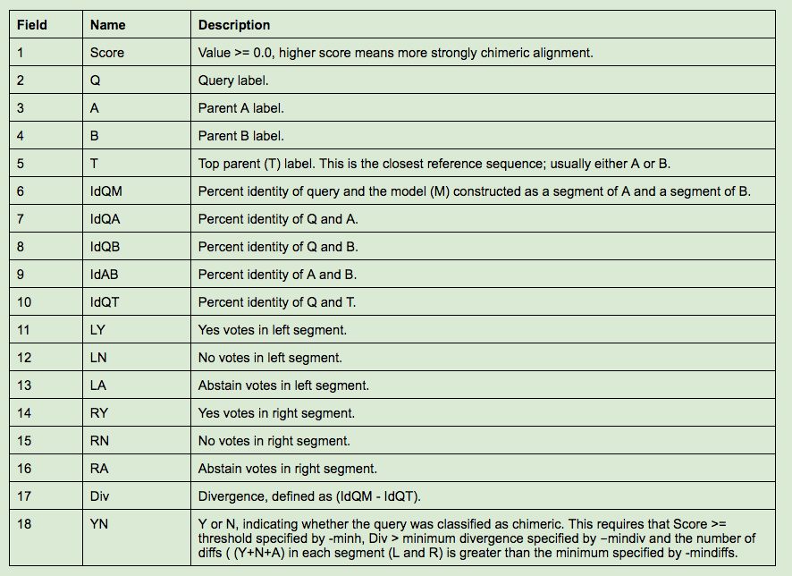
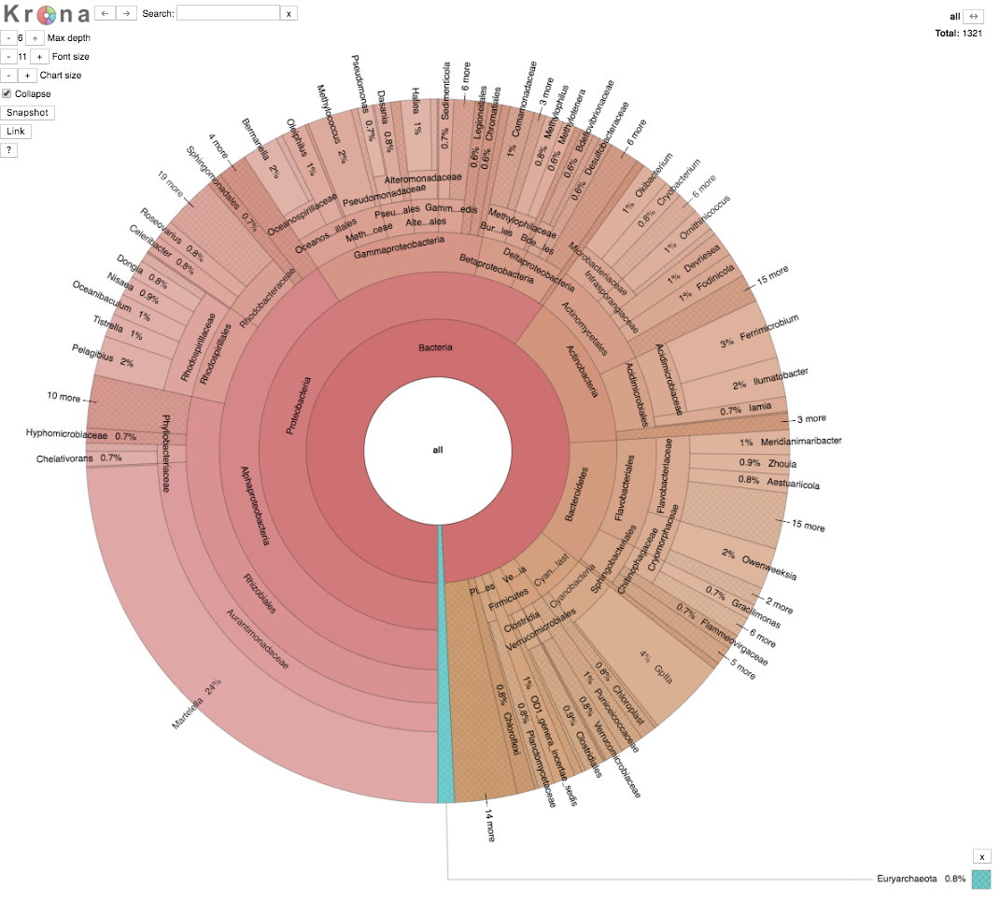
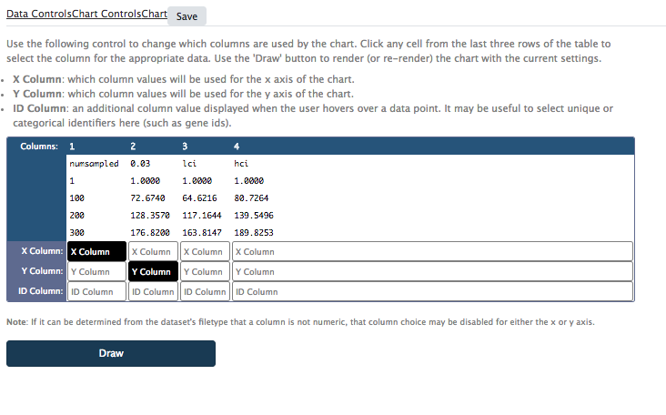
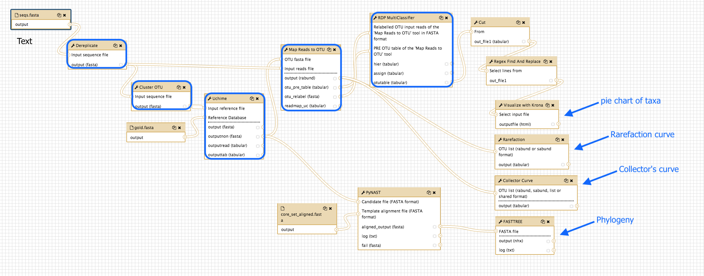

# Metagenomics

<ss>In development</ss>

*Based on material by QFAB* http.qfab.org

## Tutorial Overview

In this tutorial we cover the concepts of metagenomics analysis in 16S rRNA.

What’s not covered:

This introductory tutorial covers the steps required for the first part of a 16S rRNA metagenomics study applied to samples from a single site. As such we only show analyses that can be applied to a single environment, that is, identifying what organisms are in your sample (diversity), and how many organisms there are in the sample (richness). Similar same steps would be applied if you had samples from multiple sites, with additional analyses that can compare the diversity and richness between samples. The latter part is not covered by this tutorial.

## Background

### 16S rRNA sequencing

The application of culture-independent rRNA-based phylogenetics to the study of bacterial diversity was first explored by researchers in the 1980s e.g. [2] and was used by Carl Woese to delineate the main branches of life [1]. These rRNA based analyses remain central methods in microbiology both for the exploration of species diversity but also or the application in bacterial identification.

The development of pyrosequencing technologies and the emergence of next generation DNA sequencing have changed the scales at which scientists can systematically survey the 16S rRNA content of biological samples and has been a key driver behind initiatives such as the human microbiome project [5].

In the broadest sense, 16S rRNA sequencing should not be confused with metagenomics which has been defined as "the application of shotgun sequencing to DNA obtained directly from an environmental sample or series of related samples, producing at least 50Mbp of randomly sampled sequence data" [3] This is also in contrast to functional metagenomics whereby environmental DNA is first cloned and subsequently screened for specific functional activities e.g. [4]. Kunin et al elegantly argue that 16S rRNA profiling should in fact exist as a mandatory "Premetagenome community composition profiling" step in more comprehensive surveys [3]. There is discussion and debate as to how deep this sequencing could be performed but at JGI at least, a single 384 well plate is routinely surveyed.

Irrespective of the nuances of terminology, metagenomics is a baseline technology for understanding the ecology and evolution of microbial ecosystems upon which hypotheses and experimental strategies are built.

### Experimental design is key

Most 16S strategies are biased towards the measurement of bacterial and archaeal constituents of the environment and eukaryotes (e.g. fungi and protists) are excluded. This compromises the ability to measure the whole ecological spectrum of a microbial community; the larger and non-coding and thus uninterpretable parts of the eukaryotic genome are problematic. This is largely driving strategies that encompass additional metatranscriptomics surveys. The studies are thus oriented towards the sequence-tractable bacterial, archaeal and viral components of the research community.

### Limitations of the 16S rRNA profiling strategy

The 16S rRNA gene copy number of variable between bacterial species and this is further confounded by PCR amplification biases which skew estimates of the community composition.

### Goals

The goal of the 16S study is to understand the complexity of the community being sampled. This is assessed as a function of the number of species in the community (richness) and their relative abundances (evenness).

## The workflow in Galaxy

The process presented in this workshop is aimed to be an introduction for molecular biologists to 16S rRNA metagenomics analysis. The workflow is also implemented such that it can be run using a standard desktop or laptop environment without the requirements of a large cluster or cloud infrastructure.

The steps are:

De-replicate reads
Cluster reads into Operational Taxonomic Units (OTU)
Chimera detection and removal
OTU Table
Visualize taxa in a pie chart
Phylogenetic Tree
Rarefaction analysis
Collector Curve analysis

### Where is the data in this tutorial from?

We use the same data from the [Mothur Marine community analysis](https://www.mothur.org/wiki/Marine_community_analysis), that is  the study from the [Global Ocean Sampling (GOS) Expedition](https://www.jcvi.org/global-ocean-sampling-expedition-gos). However we only concentrate on one site as opposed to the 14 sites they sampled.

## Preparation

* Log in to your Galaxy instance (for example, Galaxy Australia, [usegalaxy.org.au](https://usegalaxy.org.au/)).

### Use shared data

If you are using Galaxy Australia, you can import the data from a shared data library.

In the top menu bar, go to <ss>Shared Data</ss>.

* Click on <ss>Data Libraries</ss>.
* Click on <fn>Galaxy Australia Training Material: Metagenomics: 16S Metagenomics</fn>.
* Tick the boxes next to the three files.
* Click the <ss>To History</ss> button, select *As Datasets*.
* Name a new history and click <ss>Import</ss>.
* In the top menu bar, click <ss>Analyze Data</ss>.
* You should now have three files in your current history.

### Or, import from the web

*Only follow this step if unable to load the data files from shared data, as described above*.

* In a new browser tab, go to this webpage:

* Right click on file name: select "copy link address"
* In Galaxy, go to <ss>Get Data</ss> and then Upload File
* Click <ss>Paste/Fetch data</ss>
* A box will appear: paste in link address
* Click <ss>Start</ss>
* Click <ss>Close</ss>
* The file will now appear in the top of your history panel.
* Repeat for the other two files.

### Shorten file names

* Click on the pencil icon next to the file name
* In the centre Galaxy panel, click in the box under <ss>Name</ss>
* Shorten the file name
* Then click <ss>Save</ss>

## Keep only the unique reads

The aim here is to reduce the number of reads in the input file into clusters of identical sequences.

### De-replicate

In the tool panel (left hand side) search for the <ss>Dereplicate</ss> tool and click on it.

* For <ss>Input sequence file</ss> select the <fn>seqs.fasta</fn> dataset
* For <ss>Criteria used for duplicate detection</ss> select *Full length*

There are two possible modes in the dereplication tool:
(1) *full-length* where the full length of the two sequences must be identical before being grouped together or
(2) *prefix* where the first section of the two sequences are identical

* Click on <ss>Execute</ss>

### Output

Click on the name of the job <fn>Dereplicate on data XX</fn> in the History panel (right hand side) and you will see the number of sequences have been reduced from 1,472 in the input data <fn>seqs.fasta</fn> to 1,459 sequences.

Examine the output by clicking on the eye icon  in the top right hand corner of this step.

* NOTE: The size=XXXX annotation in the id line of the fasta file indicates the number of reads that were exactly the same as this representative sequence.

* (OPTIONAL) You can rename the output by clicking on the pencil icon  on the top right hand corner of the output. Click on the “Attributes tab” and then  type in a new name in the “Name” field and click on Save.

## Cluster sequences into groups

The aim here is to cluster the output from Step 1 into groups of sequences that are 97% similar to each other.

* Similar sequences are assumed to belong to the same taxonomic groups. * These groups are known as Operational Taxonomic Units (OTUs) and the number of clusters that result are indicative of the number of species that are present in this sample.

### Cluter OTUs

In the tool panel on the left hand side, search for the <ss>Cluster OTU</ss> tool.

* For <ss>Input sequence file</ss>, select the output from Step 1: <fn> Dereplicate on data XX</fn>
* For <ss>Minimum cluster radius</ss>, enter 0.97. This value corresponds to 97% sequence identity.
* Click on <ss>Execute</ss>

### Output

Click on the name of the job <fn>Cluster OTU on data 4</fn> in the History panel (right hand side) and you will find that the number of sequences has decreased to 559 sequences.

* Examine the output by clicking on the eye icon  in the top right hand corner of this step.
* The output file is in Fasta format where each sequence is the representative of an OTU.
* Figure 2 below, provides a summary of the clustering approach. Reads are represented by solid dots. Those that are 97% similar to each other are grouped together into an OTU as represented by the blue dashed circles.
* In this example, there are 3 OTUs. The reads that represents the centroid of each cluster are shown as red dots and these red dots form the representative of the corresponding OTU. These are the sequences that are reported in the output file. In this tutorial, the output file has 559 sequences, meaning that 559 OTUs were identified.
* NOTE: The number of sequences that you have may not be exactly the same as mentioned here. This is so as the clustering process starts by randomly selecting a read as the center of a cluster (see figure below). Since this is a random selection, each time you perform a clustering process, a different read can be selected and thus affect the end result.

For more detailed description of the OTU clustering algorithm, click [here](http://drive5.com/usearch/manual/uparseotu_algo.html).

Figure 2.

Please Note: The “size=XX” annotation in the identifier line is NOT the number of sequences that is in the corresponding cluster (OTU). This value is the same as the input file.

## Remove chimeras

The aim here is to: identify and filter chimeric sequences utilizing a reference dataset containing nucleotide sequences believed to be free of chimeras.

### Uchime

In the tool panel on the left hand side, search for the <ss>Uchime</ss> tool.

* For <ss>Mode to detect chimeras</ss>, select “ref” (reference mode).

There are two possible modes in the Uchime tool for chimera detection: (1) *ref* where a reference dataset of parent sequences believed to be chimera-free is provided by the user or (2) *de-novo* where a database is constructed from the query sequences by using the abundance data.

* For the second field <ss>Input reference file</ss> select the <fn>Cluster OTU on data XX</fn>
* For the third  field <ss>Reference Database</ss>, select the <fn>gold.fasta</fn>. This file (downloaded from http://drive5.com/uchime/gold.fa) contains nucleotide sequences believed to be free of chimeras.
* Click on <ss>Execute</ss>

### Output

* Click on <fn>Uchime on data XX and data XX:chimeras</fn>

    * These sequences have been classified to be chimeras

* Click on <fn>Uchime on data XX and data XX:non chimeras</fn>

    * These sequences have been classified to be non-chimeras
    * Only the “non-chimeras” output be used for the subsequent steps.
    * All other sequences, chimeras  and nonclassified will be disregarded.

There are 2 hidden log files also generated from this tool, they contain detailed job information about  the classification into non-chimeras and chimeras.

(OPTIONAL) To access the hidden outputs, click on the cog wheel  in the upper right corner of the History panel and select “Include Hidden Datasets”.

* Click on <fn>Uchime on data XX and data XX:Human-readable output</fn>

    * The chimeric alignments (with respect to the putative parents) are listed following the [human-readable format](http://drive5.com/usearch/manual/UCHIME_score.html) of the [USEARCH-Tool-Suite](http://www.drive5.com/usearch/).

* Click on <fn>Uchime on data XX and data XX:Tabbed output</fn>

    * For each sequence there are 18 values logged in a tabbed format, as following:

    

NOTE: The number of sequences that you have may not be exactly the same due to the results of the OTU Clustering step in Section 2.

## How many reads per OTU cluster?

The aim here is to generate a full OTU Table which consists of the number of reads found for each group, the representative sequence and the predicted taxonomy.

* This is accomplished by running two tools and merging the resulting outputs together.
* The first tool “Map Reads to OTU”, as the name indicates will map read sequences to the OTU cluster representatives from Section 2.

    * In section 2, we clustered the reads into clusters that are 97% similar to all other members of that cluster. Then for each cluster, a representative sequence was selected. However, we do not know the number of reads that are in each cluster. Furthermore, in Section 3 we removed sequences that were potential chimeric sequences; this alters the number of remaining clusters.
    * Therefore, in this step we first find out which of the remaining clusters each read belongs with 97% similarity and this will give us a count of the number of reads per cluster.

* The second tool “RDP Multi Classifier” will assign each the OTU representative sequence to a taxonomy level.

* The last step then merges the information to generate the OTU Table

### Map reads to OTU - how many reads per OTU?

In the tool panel on the left hand side, search for the <ss>Map Reads to OTU</ss> tool.

* For <ss>OTU fasta file</ss> select dataset <fn>Uchime on data XX and data XX: non_chimeras</fn>
* For <ss>Input reads file</ss> select dataset <fn>Dereplicate on data XX</fn>
* For <ss>Minimum identity</ss> enter 0.97. Like before, this value corresponds to 97% sequence similarity.
* Click on <ss>Execute</ss>

### Output

* Click on <fn>Map Reads to OTU on data XX and data XX:rabund</fn>

    * The output is tab delimited and follows the 'rabund' format from [mothur](https://www.mothur.org/wiki/Main_Page).
    * Note that this is just a one-line file which wraps around in the Galaxy display window to look like a multi-line file.
    * In other words, this is a matrix of one row only, and many columns.
    * The first column is a label (this is usually the identity)
    * The second column is the number of OTUs found
    * Each subsequent column is the number of reads found for the corresponding OTUs.

* Click on <fn>Map Reads to OTU on data XX and data XX:Pre-OTU Table</fn>

    * This is the pre OTU table with the following columns: OTU label, Count, Sequence

* Click on <fn>Map Reads to OTU on data XX and data XX:relabelled OTU</fn>

    * This is a FASTA file.
    * The input reads from <fn>Uchime on data XX and data XX: non_chimeras</fn> have been re-labelled with convenient labels for parsing, e.g. OTU_1, OTU_2,...OTU_N, where N is the number of OTUs.

There is one hidden log file also generated from this tool, which reports whether a query sequence matches or not matches the database.

(OPTIONAL) To access the hidden output, click on the cog wheel  in the upper right corner of the History panel and select “Include Hidden Datasets”.

* Click on <fn>Map Reads to OTU on data XX and data XX:hit list</fn>

    * This file reports query sequences that match or did not match the database <fn>Cluster OTU on data XX</fn> following the [UC-format](http://drive5.com/usearch/manual/ucout.html) of the [USEARCH-Tool-Suite](http://www.drive5.com/usearch/).
    * Note that a given read may match two or more OTUs given the identity threshold. In such cases the tool will tend to assign the read to the OTU with highest identity and will break ties arbitrarily.
    * Some reads may not match any OTU for these reasons: (1) the read is chimeric, (2) the read has more than 3% errors, (3) the read has a singleton sequence so was discarded.

### RDP Classifier - what taxa match the OTUs?

A complete OTU table contains the taxonomy assignment of each sequence. To complete the Pre-OTU Table, we will use the <ss>RDP MultiClassifier</ss> tool.

In the tool panel on the left hand side, search for the <ss>RDP MultiClassifier</ss> tool.

* For <ss>Select Gene Trainings Model</ss> select “16S rRNA” from the dropdown list.
* For <ss>Select to generate an OTU Table</ss> click *Yes*.
* For <ss>Relabelled OTU input reads of the ‘Map Reads to OTU’ tool in FASTA format</ss> choose <fn>Map Reads to OTU on data XX and data XX:relabelled OTU</fn>
* For <ss>PRE OTU table of the ‘Map Reads to OTU’ tool</ss> select <fn>Map Reads to OTU on data XX and data XX:Pre-OTU Table</fn>
* For <ss>Assignment confidence cutoff</ss>, enter 0.8.
    * This value is used to specify the assignment confidence cutoff used to determine the assignment count in the hierarchical format. The range is between 0 and 1 with 0.8 being the default value. For sequences that are shorter than 250 base pairs, the tool developers recommend using 0.5 as the confidence threshold. (http://rdp.cme.msu.edu/tutorials/classifier/RDPtutorial_MULTICLASSIFIER.html)

* For <ss>Tab delimited output format</ss>, select “fixrank“ from the drop-down list
* Click on <ss>Execute</ss>

### Output

* Click on <fn>RDP MultiClassifier on data XX and data XX:classification_assignment_hierarchical.tab</fn>

    * Sequence count for each taxon in the hierarchy

* Click on <fn>RDP MultiClassifier on data XX and data XX:classification_assignment_details.tab</fn>

    * Sequence-by-sequence classification results including confidence scores at each level of the hierarchy

* Click on <fn>RDP MultiClassifier on data XX and data XX:OTU_Table.tab</fn>

    * The OTU table is composed of the following columns: OTU label, Count, Sequence, Phylogenetic lineage.

## View taxa with Krona

Krona is a tool that shows you a pie chart of the taxa found in your sample.

### Tidy the output

**Cut some columns**

Search for <ss>Cut columns</ss>

* <ss>Cut columns</ss>: c2,c4,c7,c10,c13,c16,c19
* <ss>Delimited by</ss>: Tab
* <ss>From</ss>: the <fn>RDP MultiClassifier OTU_Table.tab</fn>
* <ss>Execute</ss>

**Take out the quotation marks**

Search for <ss>Regex Find And Replace</ss>

* For <ss>Select lines from</ss>: the previous file, <fn>Cut on data XX</fn>
* Click <ss>Insert Check</ss>
* <ss>Find Regex</ss>: "
* <ss>Replacement</ss>: delete any text in here and leave empty
* <ss>Execute</ss>

### Krona

Search for <ss>Visualize with Krona</ss>

* For <ss>Select input file</ss>: the previous file, <fn>Regex Find And Replace on data XX</fn>
* <ss>Is this output from MOTHUR</ss>: *No*
* <ss>Execute</ss>

Click on the eye icon next to the output file.

* This is a pie chart showing the abundance of taxa. The higher taxonomic levels are in the centre, and the lower taxonomic levels are in the outer circle.
* Click on a taxon to display the information in more detail.
* Most of our sample is classified as Bacteria.
* A particularly abundant genus is *Martelelella*.

## Phylogeny

How are our taxa related phylogenetically? We will run two tools to investigate.

<!--

### Re-run the classifier

First we need to re-run the classifier with a different setting.

In the tool panel on the left hand side, search for the <ss>RDP MultiClassifier</ss> tool.

* For <ss>Select Gene Trainings Model</ss> select “16S rRNA” from the dropdown list.
* For <ss>Select to generate an OTU Table</ss> click *Yes*.
* For <ss>Relabelled OTU input reads of the ‘Map Reads to OTU’ tool in FASTA format</ss> choose <fn>Map Reads to OTU on data XX and data XX:relabelled OTU</fn>
* For <ss>PRE OTU table of the ‘Map Reads to OTU’ tool</ss> select <fn>Map Reads to OTU on data XX and data XX:Pre-OTU Table</fn>
* For <ss>Assignment confidence cutoff</ss>, enter 0.8.
* For <ss>Tab delimited output format</ss>, select “allrank“ from the drop-down list
* Click on <ss>Execute</ss>

-->

### PyNAST

The aim here is to build and visualise the phylogenetic tree.

* First, we align the sequences to a template sequence using PyNAST.
* PyNast is a reimplementation of the NAST algorithm to align each provided sequence (the “candidate” sequence) to the best-matching sequence in a pre-aligned database of sequences (the “template” sequence).

In the tool panel on the left hand side, search for the <ss>PyNAST</ss> tool.

* For <ss>Candidate file (Fasta format)</ss> select <fn>Uchime on data XX and data XX:non_chimeras</fn>
* For <ss>Template alignment file (Fasta format)</ss>, select <fn>core_set_aligned.fasta</fn>
* For <ss>Minimum sequence length</ss>, enter 1000.

    * The minimum sequence length is the length to include in the NAST alignment and it has to be set according to your set of your sequences.

* Click <ss>Execute</ss>

Outputs:

* Click on <fn>PyNAST on data XX and data XX: pynast aligned</fn>

    * This file contains the alignment. You will find that the number of sequences might have decreased. This means  that the alignment for some sequences failed. More information is given in the log file and the failure file, which are hidden outputs.

(OPTIONAL) To access the hidden outputs, click on the cog wheel in the upper right corner of the History  panel and select “Include Hidden Datasets”.

* Click on <fn>PyNAST on data XX and data XX: pynast log file</fn>

This file is composed of the following columns:

* candidate sequence ID
* candidate nucleotide count
* errors
* template ID
* BLAST percent identify to template
* candidate nucleotide count post-NAST

You will observe that some sequences have an entry in the error column: “No search results”. These are the sequences that failed to align.

* Click on <fn>PyNAST on data XX and data XX: pynast failure</fn>

    * This file contains the sequences that failed to align. We already found out through the log file which sequences failed to align; here those sequences are given in FASTA format.

### FastTree

Next we use “Fast Tree” to generate the phylogenetic tree using the aligned sequenced file.

In the tool panel on the left hand side, search for the <ss>FastTree</ss> tool.

* For <ss>Aligned sequences file (FASTA format)</ss>, select <fn>PyNAST on data XX and data XX:pynast aligned</fn>
* For <ss>Protein or nucleotide alignment</ss> select “Nucleotide”
* Click <ss>Execute</ss>

Output

* Click on <fn>FastTree on data 18:tree.nhx</fn>

    * To visualize the phylogenetic tree, click on the “Visualize” icon  under the file name.
    * Click on <ss>Phyloviz</ss>
    * Phyloviz is the interactive Phylogenetic Tree Visualizer included from Galaxy.  Currently Phyloviz has only one entry point, which is via the “Visualize - View in Phyloviz” icon that will appear for all supported phylogenetic data sets.  
    * Phyloviz will lay out the tree in a linear format. All phylogenetic distances are normalized to a value between 0 to 1.0 inclusive, and a default value of 250px would represent 1.0 units from a parent node to child node. The laying out of phyloviz is “in-place” meaning that the tree is presented in the same order as it is represented in the data and that no nodes are shuffled.
    * Phyloviz supports a number of user interaction features to help you present, analyze and share the visualization. Please see the Galaxy wiki for more information on Phyloviz.

(OPTIONAL) To access the hidden log file, click on the cog wheel  in the upper right corner of the History panel and select “Include Hidden Datasets”.

* Click on <fn>FastTree on data XX:log_FastTree_run.txt</fn>

    * This is the log file from Fast tree and shows job related information. It is not required for the analysis workflow.

## Was sampling sufficient? Rarefaction analysis

The aim here is to generate an intra-sample rarefaction curve to determine if the sampling effort was sufficient.

* Rarefaction curves provide a way of comparing the richness observed in different samples although it is a better measure of sample diversity.
* Briefly, it plots the average number of OTUs that you would expect to observe against the number of sequences.
* If the curve plateaus off, then it is a good indication that the sample is saturated and you have captured the majority (if not all) of species/strains present in the sample.
* However, if the curve does not plateau off, this suggests there may still be more species/strains that have not been captured in your data and you need increase the size of your sample.

### Rarefaction tool

In the tool panel on the left hand side, search for the <ss>Rarefaction</ss> tool.

* For <ss>Input file format</ss> select *rabund* from the dropdown list
* For <ss>OTU list (rabund or sabund format)</ss>, select <fn>Map Reads to OTU on data XX and data XX:rabund</fn>
* For <ss>Minimum identity used in OTU clustering</ss>, enter the minimum identity used when you generated the OTU Table. In this tutorial we used 0.97.

    * In case you can’t remember the minimum identity used, go back to the output file <fn>Cluster OTU on data XX</fn> in your History. Click on the file name to extend the dataset information. Click on the “View details” icon. In the Input Parameter section you will find the “Minimum cluster radius” you used in the OTU Clustering step.

* Click <ss>Execute</ss>

### Output

* Click on <fn>Rarefaction on data XX</fn>.

    * The output is a tabbed delimited file with the following columns:
    * The first column (numsampled): the number sampled and indicates the level of sampling intensity (by default this information is provided every 100 individuals)
    * The second column (0.03) is the average number of OTUs that were observed for that sampling intensity based on the number of iterations, which is 1000 by default. This would represents the data for the y-axis for the corresponding minimum identity (1-0.97=0.03).
    * The third column (lci) and fourth column (hci) represent the confidence intervals.

To plot the rarefaction curve:

* Click on <fn>Rarefaction on data XX</fn> to extend the dataset information.
* Click on the “Visualize” icon
* Select “Scatterplot”
* Under Column 1, highlight "X Column" (the number sampled)
* Under Column 2, highlight "Y Column" (the average number of OTUs that were observed for that sampling intensity based on the number of iterations, which is 1,000 by default).

* Click Draw

## Estimate diversity

The aim here is to estimate the diversity and richness of the sample.

* Collector's curves describe how the richness or diversity change as you add more samples into the dataset.
* If a collector's curve plateaus, it is a good indication that enough samples were collected and you can have confidence in the last value of the curve.

### Collector's curve

In the tool panel on the left hand side, search for the <ss>Collector Curve</ss> tool.

* For <ss>OTU list (rabund, sabund, list or shared format)</ss>, select <fn>Map Reads to OTU on data XX and data XX:rabund</fn>
* For <ss>Labels - OTU labels</ss>, Click <ss>Select</ss> and make sure that <fn>0.03</fn> appears in the box.

    * This correspondd to 97%. Note that this value is the inverse of other similarity thresholds we used thus far (1-0.97=0.03) and is the default value.

* For <ss>Calculators</ss>, there is no need to change anything from the default calculators:

    * *chao* - Community richness  - the Chao estimator
    * *invsimpson* - Community diversity - the Simpson index
    * *npshannon* - Community diversity - the non-parametric Shannon index.

* Click <ss>Execute</ss>

### Output

* Click on <fn>Collector Curve on data XX:tab</fn>

    * This file provides a summary containing the following fields: number of sequences, the sample coverage, the number of observed OTUs, and then a summary of each of the selected calculators that were applied to the sample.         

* Click on <fn>Collector Curve on data XX:tab (invsimpson)</fn>

    * The [Simpson’s Inverse Index](https://www.mothur.org/wiki/Invsimpson) also referred to as Simpson’s Reciprocal Index is a measure of diversity.
    * Species diversity is a way to compare samples that incorporates both a measure of evenness (representation by each species) and richness (number of each species in the sample).
    * This index starts with the value of 1 as the lowest possible figure. This figure would represent a community containing only one species. The higher the value, the greater the diversity. The maximum value is the number of species in the sample.

* Click on <fn>Collector Curve on data XX:tab (npshannon)</fn>

    * The [non-parametric Shannon Index](https://www.mothur.org/wiki/Npshannon), like the Simpson’s Inverse Index, is a diversity estimator and calculates a non-parametric estimate of the classical [Shannon](https://www.mothur.org/wiki/Shannon) diversity Index for an OTU definition.
    * The interpretation of the curve has to be performed in a comparison to the diversity curve of one or more communities.

* Click on <fn>Collector Curve on data XX:tab (chao)</fn>

    * The [Chao1 estimator](https://www.mothur.org/wiki/Chao) is a species richness estimator. The species richness estimators estimate the total number of species present in a community. The Chao1 index estimator the species richness for one community based on the observed species frequencies or presence/absence data.

    * If you compare the rarefaction curve (observed richness) and Chao1 estimator curve (estimated richness), you will observe a gap. The greater estimated richness in comparison to the observed richness usually indicates that with further sampling, the richness would likely continue to increase. Please note that if a sample contains many singletons, it is likely that more undetected OTUs exist, and the Chao1 index will estimate greater species richness than it would for a sample without rare OTUs.

These three outputs are tabbed delimited with the following columns:

* First column (numsampled): is the number sampled and indicates the level of sampling intensity (by default this information is provided every 100 individuals)

* The second column (0.03) is the average number of OTUs that were observed for that sampling intensity based on the number of iterations, which is 1000 by default. This would represents the data for the y-axis for the corresponding minimum identity (1-0.97=0.03).

* The third column (lci) and fourth column (hci) represent the confidence intervals

These files can be plotted similar to the rarefaction curve in the previous step.

### Plot the collector’s curves

* Click on <fn>Collector Curve on data XX:tab (invsimpson)</fn> to extend the dataset information.
* Click on the now accessible “Visualize” icon
* Select “Scatterplot”

* Under Column 1, highlight "X Column" (the number sampled)
* Under Column 2, highlight "Y Column" (the average number of OTUs that were observed for that sampling intensity based on the number of iterations, which is 1,000 by default).
* Click <ss>Draw</ss>

Repeat to plot the curves from the other calculators.

## The workflow canvas

## References

1. Woese CR, Kandler O, Wheelis ML (1990) Towards a natural system of organisms: proposal for the domains Archaea, Bacteria, and Eucarya. Proc Natl Acad Sci U S A 87: 4576-4579.

2. Lane DJ, Pace B, Olsen GJ, Stahl DA, Sogin ML, et al. (1985) Rapid determination of 16S ribosomal RNA sequences for phylogenetic analyses. Proc Natl Acad Sci U S A 82: 6955-6959.

3. Kunin V, Copeland A, Lapidus A, Mavromatis K, Hugenholtz P (2008) A bioinformatician's guide to metagenomics. Microbiol Mol Biol Rev 72: 557-578.

4. Handelsman J, Rondon MR, Brady SF, Clardy J, Goodman RM (1998) Molecular biological access to the chemistry of unknown soil microbes: a new frontier for natural products. Chem Biol 5: R245-249.

5. Turnbaugh PJ, Ley RE, Hamady M, Fraser-Liggett CM, Knight R, et al. (2007) The human microbiome project. Nature 449: 804-810.

6. Holmes S, Alekseyenko A, Timme A, Nelson T, Pasricha PJ, et al. (2011) Visualization and statistical comparisons of microbial communities using R packages on phylochip data. Pac Symp Biocomput: 142-153.

7. Hamady M, Lozupone C, Knight R (2010) Fast UniFrac: facilitating high-throughput phylogenetic analyses of microbial communities including analysis of pyrosequencing and PhyloChip data. ISME J 4: 17-27.

8. Brodie EL, Desantis TZ, Joyner DC, Baek SM, Larsen JT, et al. (2006) Application of a high-density oligonucleotide microarray approach to study bacterial population dynamics during uranium reduction and reoxidation. Appl Environ Microbiol 72: 6288-6298.
