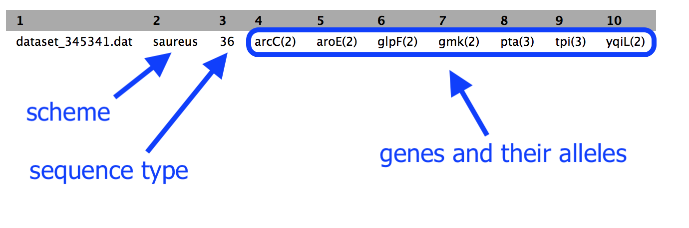

# Using MLST for bacterial typing

A bacterial "type" is a particular species with certain features.

* For example, the bacterial type may be *Staphyloccus aureus* with resistance to penicillin.
* To "type" a bacteria, we can focus on several genes, and see which allele is present for each of these genes.
* Each bacterial species will have its own scheme, which is the set of genes that are looked at.
* Overall, this process is called multi-locus (= several genes) sequence typing, or MLST.

In this tutorial, we will perform MLST on a bacterial sequence.

<fn>**New to Galaxy?** First try the [introduction](../galaxy/index.md) and then learn some [key tasks](../intro/index.md)</fn>

## Get data

* Log in to your Galaxy instance (for example, Galaxy Australia, [usegalaxy.org.au](https://usegalaxy.org.au/)).

If you are using Galaxy Australia, look for the file we need in the <ss>Shared Data</ss>.

* In the top centre panel, go to <ss>Shared Data</ss>
* Click <ss>Histories</ss>
* Click on the history named <fn>MLST-tutorial</fn>
* Click <ss>Import</ss> (in the top right corner)
* This should now be your current history.

**Alternatively**, we can get the sequence from Genbank.

* In a new browser tab, go to this address: [https://www.ncbi.nlm.nih.gov/nuccore/NC_002952.2](https://www.ncbi.nlm.nih.gov/nuccore/NC_002952.2)
* Click <ss>Send to</ss>
* Choose <ss>File</ss>
* Choose <ss>FASTA</ss>
* Click <ss>Create File</ss>

This downloads <fn>sequence.fasta</fn> to your computer.

In the tool panel, go to <ss>Get Data -> Upload File</ss>

* <ss>Choose local file</ss>: select <fn>sequence.fasta</fn>
* <ss>Start</ss>
* <ss>Close</ss>

This file should now be in your History panel. When it has completed uploading, the file name will be green.

## Run MLST

In the tool panel search box, search for MLST.

* Click <ss>MLST</ss>

The tool interface will appear in the centre Galaxy panel.

* For <ss>input_file</ss>, choose the sequence file that you uploaded, e.g. <fn>sequence.fasta</fn>
* Click <ss>Execute</ss>

## What does MLST do?

* Takes a fasta or genbank file
* Scans this against all the typing schemes
* Finds the best match (e.g. a scheme for the correct species)
* Reports the output:
    * the scheme chosen
    * the sequence type (e.g. ST = 21)
    * the genes in this scheme and the alleles found in the data

## View results

The results file will be at the top of your history panel.

* Click on the eye icon to view the output.

* Your results will be a single line.

For example:

* Column 2: the scheme
* Column 3: the sequence type
* The rest of the columns: the gene names with the allele number in brackets. It is this combination of alleles that defines the sequence type.

In this example, our sequence type is ST=36. This is methicillin-resistant *Staphylococcus aureus* (or MRSA).

## See this history in Galaxy

If you want to see this Galaxy history without performing the steps above:

* Go to <ss>Shared Data</ss>
* Click <ss>Histories</ss>
* Click <fn>Completed-MLST-analysis</fn>
* Click <ss>Import</ss> (at the top right corner)

## What's next?

To use the tutorials on this website:

* &#8592; see the list in the left hand panel
* &#8598; or, click the **menu button** (three horizontal bars) in the top left of the page

You can find more tutorials at the Galaxy Training Network:

* [http://galaxyproject.github.io/training-material/](http://galaxyproject.github.io/training-material/)
