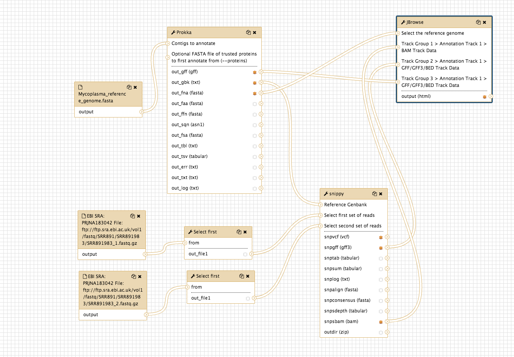

# Variant calling with Snippy

Variant calling is the process of identifying differences between two genome samples.

* Differences are usually limited to single nucleotide polymorphisms (SNPs) and small insertions and deletions (indels).
* Larger structural variation such as inversions, duplications and large deletions are not typically covered by "variant calling".
* In this tutorial, we will use the tool "Snippy" (link to Snippy is [here](https://github.com/tseemann/snippy)).
* Snippy uses a tool to align the reads to a reference genome, and another tool to decide ("call") if the discrepancies are real variants.

<fn>**New to Galaxy?** First try the [introduction](../galaxy/index.md) and then learn some [key tasks](../intro/index.md)</fn>

<!--
## Learning Objectives

1. Find variants between a reference genome and a set of reads
2. Visualise the SNP in context of the reads aligned to the genome
3. Determine the effect of those variants on genomic features
4. Understand if the SNP is potentially affecting the phenotype
-->

## Get data

* Log in to your Galaxy instance (for example, Galaxy Australia, [usegalaxy.org.au](https://usegalaxy.org.au/)).

### Use shared data

If you are using Galaxy Australia, you can import the data from a shared data library.

In the top menu bar, go to <ss>Shared Data</ss>.

* Click on <ss>Data Libraries</ss>.
* Click on <fn>Galaxy Australia Training Material: Variant Calling: Microbial Variant Calling</fn>.
* Tick the boxes next to the five files.
* Click the <ss>To History</ss> button, select *As Datasets*.
* Name a new history and click <ss>Import</ss>.
* In the top menu bar, click <ss>Analyze Data</ss>.
* You should now have five files in your current history.

### Or, import from the web

*Only follow this step if unable to load the data files from shared data, as described above*.

* In a new browser tab, go to this webpage:

* Find the file called <fn>mutant_R1.fastq</fn>
* Right click on file name: select "copy link address"
* In Galaxy, go to <ss>Get Data</ss> and then Upload File
* Click <ss>Paste/Fetch data</ss>
* A box will appear: paste in link address
* Click <ss>Start</ss>
* Click <ss>Close</ss>
* The file will now appear in the top of your history panel.
* Shorten the file name if you wish. (Click the pencil icon).

Repeat these steps for the other set of reads (reverse reads) called <fn>mutant_R2.fq</fn>:

* In a new browser tab, go to this webpage:

* Find the file called <fn>mutant_R2.fastq</fn>
* Right click on file name: select "copy link address"
* In Galaxy, go to <ss>Get Data</ss> and then Upload File
* Click <ss>Paste/Fetch data</ss>
* A box will appear: paste in link address
* Click <ss>Start</ss>
* Click <ss>Close</ss>
* The file will now appear in the top of your history panel.
* Shorten the file name if you wish.

Repeat these steps for three other files: <fn>wildtype.gbk</fn>, <fn>wildtype.gff</fn> and <fn>wildtype.fna</fn>.

### Shorten file names

* Click on the pencil icon next to the file name.
* In the centre Galaxy panel, click in the box under <ss>Name</ss>
* Shorten the file name.
* Then click <ss>Save</ss>

## Call variants with Snippy

Go to the Tool panel and search for "snippy" in the search box.

* Click on <ss>snippy</ss>

Set the following parameters (leave other settings as they are):

- For <ss>Reference type</ss> select *Genbank*.
- Then for <ss>Reference Genbank</ss> choose the <fn>wildtype.gbk</fn> file.
- For <ss>Single or Paired-end reads</ss> choose *Paired*.
- Then choose the first set of reads, <fn>mutant_R1.fastq</fn> and second set of reads, <fn>mutant_R2.fastq</fn>.
- For <ss>Cleanup the non-snp output files</ss> select *No*. The box will be a darker grey.

Your tool interface should look like this:

- Click <ss>Execute</ss>.

## Examine Snippy output

<!-- First, enable "Scratchbook" in Galaxy - this allows you to view several windows simultaneously. Click on the squares:

-->
From Snippy, there are 10 output files in various formats.

- Go to the **table** file called <fn>snippy on data XX, data XX and data XX table</fn> and click on the eye icon.
* (The XX refers to the number that Galaxy has given your files.)
- We can see a list of variants. Look in column 3 to see which types the variants are, such as a SNP or a deletion.
- Look at the third variant called. This is a T&rarr;A mutation, causing a stop codon. Look at column 14: the product of this gene is a methicillin resistance protein. Methicillin is an antibiotic. What might be the result of such a mutation? <!--[add a hint/info box]-->

## View Snippy output in JBrowse

- Go to the Galaxy tools panel, and use the search box at the top to search for "JBrowse".

- Under <ss>Reference genome to display</ss> choose *Use a genome from history*.

- Under <ss>Select the reference genome</ss> choose <fn>wildtype.fna</fn>. This sequence will be the reference against which annotations are displayed.

- For <ss>Produce a Standalone Instance</ss> select *Yes*.

- For <ss>Genetic Code</ss> choose *11: The Bacterial, Archaeal and Plant Plastid Code*.

- Under <ss>JBrowse-in-Galaxy Action</ss> choose *New JBrowse Instance*.

- We will now set up three different tracks - these are datasets displayed underneath the reference sequence (which is displayed as nucleotides in FASTA format). We will choose to display the sequence reads (the .bam file), the variants found by snippy (the .gff file) and the annotated reference genome (the wildtype.gff)

*Track 1 - sequence reads*

- Click <ss>Insert Track Group</ss>
- For <ss>Track Cateogry</ss> name it "sequence reads"
- Click <ss>Insert Annotation Track</ss>
- For <ss>Track Type</ss> choose *BAM Pileups*
- For <ss>BAM Track Data</ss> select <fn>the snippy bam file</fn>
- For <ss>Autogenerate SNP Track</ss> select *Yes*

*Track 2 - variants*

- Click <ss>Insert Track Group</ss> again
- For <ss>Track Category</ss> name it "variants"
- Click <ss>Insert Annotation Track</ss>
- For <ss>Track Type</ss> choose *GFF/GFF3/BED/GBK Features*
- For <ss>Track Data</ss> select <fn>the snippy snps gff file</fn>

*Track 3 - annotated reference*

- Click <ss>Insert Track Group</ss> again
- For <ss> Track Category</ss> name it "annotated reference"
- Click <ss>Insert Annotation Track</ss>
- For <ss>Track Type</ss> choose *GFF/GFF3/BED/GBK Features*
- For <ss>Track Data</ss> select <fn>wildtype.gff</fn>
 
 
- Click <ss>Execute</ss>

A new file will be created, called <fn>JBrowse on data XX and data XX - Complete</fn>. (This may take some time. If you would like to see a completed history for this tutorial, instructions are in the next section.)

* Click on the eye icon next to the file name. The JBrowse window will appear in the centre Galaxy panel.

- On the left, tick boxes to display the tracks

- Use the minus button to zoom out to see:
    - sequence reads and their coverage (the grey graph)

- Use the plus button to zoom in to see:
    - probable real variants (a whole column of snps)
    - probable errors (single one here and there)

- In the coordinates box, type in *47299* and then <ss>Go</ss> to see the position of the SNP discussed above.
    - the correct codon at this position is TGT, coding for the amino acid Cysteine, in the middle row of the amino acid translations.
    - the mutation of T &rarr; A turns this triplet into TGA, a stop codon.

    

## Extension exercise

Let's repeat this tutorial using other data.

* We will investigate the bacteria *Mycoplasma synoviae* as it has a small genome and will not take too long to analyse.
* We want to find out if our sequencing reads vary from a reference genome.
* To get some sequencing reads, follow the instructions [here](../shortreads/index.md).
    * This will give us paired-end sequencing reads (two files).

* These files are very large. To subsample them so that we can run the analysis in a shorter time:
    * Search for *Select first* in the tool search box
    * Select first **4001** lines
    * from the <fn>R1.fastq</fn> file
    * Execute
    * Repeat this for the <fn>R2.fastq</fn> file

* To obtain a reference genome, follow the instructions [here](../refseq/index.md) including the Prokka step.
    * This will give us 12 output files from Prokka.
    * We need three of these files: the genbank file  <fn>Prokka.gbk</fn>, the fasta file <fn>Prokka.fna</fn>, and the gff file <fn>Prokka.gff</fn>.
    * Galaxy has interpreted the genbank file as a text file. Click on the pencil icon next to the genbank file; click Datatypes, and change the datatype to "genbank".

* Run snippy on the sequencing reads.
    * For the reference genome, use the <fn>Prokka:gbk</fn> file.
    * Remember to check *No* for *Cleanup the non-snp output files*. We want all the output files.

<!-- * Snippy has mapped the sequencing reads to the reference genome and produced a BAM file.
    * This is a very large file so we will sub-sample it.
    * In the tool panel, search for "downsample". Click on the "Downsample SAM/BAM" tool.
    * The input file is the snippy BAM file.
    * Set the probability to 0.01
-->

* Run JBrowse to produce a visualization of the called variants.
    * For the reference genome, use the <fn>Prokka.fna</fn> file.
    * As we did above, set up three "Tracks" to view underneath this reference genome nucleotide sequence: The <fn>snippy.bam</fn> file showing the reads mapped to the reference, the <fn>snippy.gff</fn> file showing the snps (the variants), and the annotated reference genome <fn>Prokka.gff</fn>.

You should now have a JBrowse file showing the results of variant calling on these reads of the bacteria *Mycoplasma synoviae*. Can you find any variants?

The workflow:

## See this history in Galaxy

If you want to see this Galaxy history without performing the steps above:

* Log in to Galaxy Australia: [https://usegalaxy.org.au/](https://usegalaxy.org.au/)
* Go to <ss>Shared Data</ss>
* Click <ss>Histories</ss>
* Click <fn>Completed-variant-calling-analysis</fn>
* Or, click <fn>Completed-variant-calling-with-extension</fn> - this includes the extension exercise.
* Click <ss>Import</ss> (at the top right corner)
* The analysis should now be showing as your current history.

## More information

Here are some references covering more information about variant calling.

** *Comparison of variant calling tools:* ** Sandmann S, de Graaf AO, Karimi M, van der Reijden BA, Hellström-Lindberg E, Jansen JH, Dugas M. Evaluating Variant Calling Tools for Non-Matched Next-Generation Sequencing Data. Sci Rep. 2017 Feb 24;7:43169.

** *Human variant calling pipelines:* ** Hwang S, Kim E, Lee I, Marcotte EM. Systematic comparison of variant calling pipelines using gold standard personal exome variants. Sci Rep. 2015 Dec 7;5:17875.

** *Rare and common disease variants:* ** Fritsche LG, Igl W, Bailey JNC, et al. A large genome-wide association study of age-related macular degeneration highlights contributions of rare and common variants. Nat Genet. 2016 Feb;48(2):134–43.

** *Variant calling in the Ebola virus:* ** Quick J, Loman NJ, Duraffour S, Simpson JT, et al. Real-time, portable genome sequencing for Ebola surveillance. Nature. 2016 Feb 11;530(7589):228–32.

** *Variant calling to detect antibiotic-resistant bacteria:* ** Kpeli G, Buultjens AH, Giulieri S, Owusu-Mireku E, Aboagye SY, Baines SL, Seemann T, Bulach D, Gonçalves da Silva A, Monk IR, Howden BP, Pluschke G, Yeboah-Manu D, Stinear T. Genomic analysis of ST88 community-acquired methicillin resistant Staphylococcus aureus in Ghana. PeerJ. 2017 Feb 28;5:e3047.

** *High coverage artifacts:* ** Li H. Toward better understanding of artifacts in variant calling from high-coverage samples. Bioinformatics. 2014 Oct 15;30(20):2843–51.

## What's next?

To use the tutorials on this website:

* &#8592; see the list in the left hand panel
* &#8598; or, click the **menu button** (three horizontal bars) in the top left of the page

You can find more tutorials at the Galaxy Training Network:

* [http://galaxyproject.github.io/training-material/](http://galaxyproject.github.io/training-material/)
