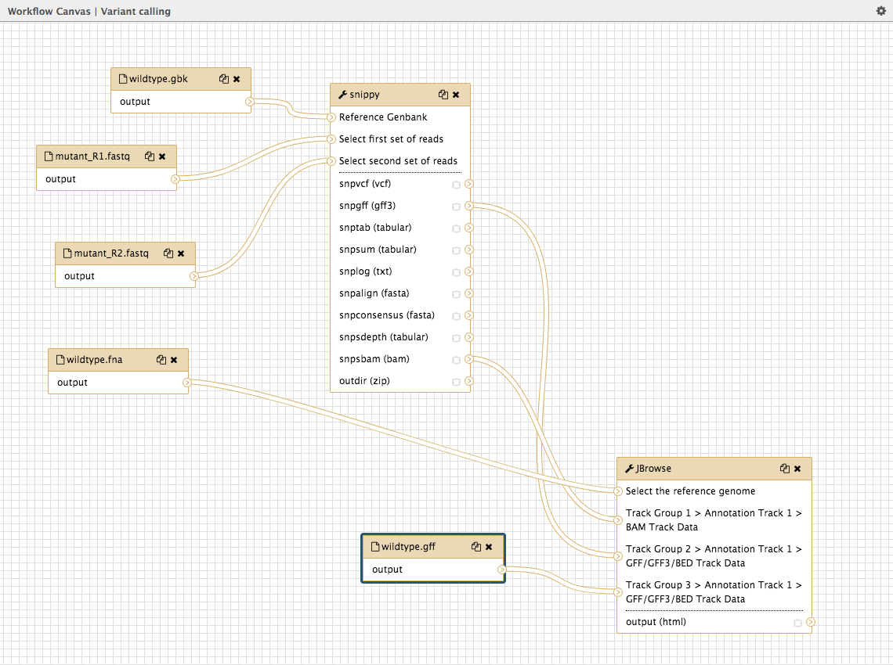

# Workflow: Variant Calling

## Create a Galaxy workflow

Galaxy provides the option to extract a workflow based on the steps you just followed and the tools and parameters used.

<fn>**New to Galaxy?** First try the [introduction](../galaxy/index.md) and then learn some [key tasks](../intro/index.md)</fn>

## Variant calling

* Log in to your Galaxy instance (for example, Galaxy Australia, [usegalaxy.org.au](https://usegalaxy.org.au/)).

Before we create a workflow for variant calling, we need the correct files in our current Galaxy history. We can get these files in two ways:

* Either follow the tutorial on [variant calling](../snippy/index.md)

* Or, obtain the files from a Shared History (Galaxy Australia only).
    * Go to <ss>Shared Data</ss>
    * Click <ss>Histories</ss>
    * Click <fn>Variant_calling_with_snippy</fn>
    * Click <ss>Import</ss> (at the top right corner)
    * The analysis should now be showing as your current history.

When you have completed this tutorial or imported the history, you will have the correct files in your history panel.

## Extract the Workflow

* In the history panel, click on the cog icon.
* Click <ss>Extract Workflow</ss>
* If all looks ok, click <ss>Create Workflow</ss>
* In the centre panel, click <ss>edit</ss>

This brings up the workflow canvas, a space for graphically viewing and re-arranging your workflow.

* Drag the panes around until your workflow is clear.
* In the top right corner click on the cog icon and <ss>Save</ss>
* Click on the cog icon again and <ss>Run</ss>
    * <ss>Send results to a new history</ss>: *Yes*
    * Check all input files are correct and change if necessary
    * In the top right corner <ss>Run workflow</ss>

* This workflow will now run.
* In the History panel, click on the <ss>View all histories</ss> icon

* Find your workflow history and <ss>Switch to</ss> it.

To see all your workflows, go to the top panel in Galaxy and click <ss>Workflow</ss>.

* You can edit or run workflows from here by clicking on the drop-down arrow next to each workflow.

## What's next?

To use the tutorials on this website:

* &#8592; see the list in the left hand panel
* &#8598; or, click the **menu button** (three horizontal bars) in the top left of the page

You can find more tutorials at the Galaxy Training Network:

* [http://galaxyproject.github.io/training-material/](http://galaxyproject.github.io/training-material/)
