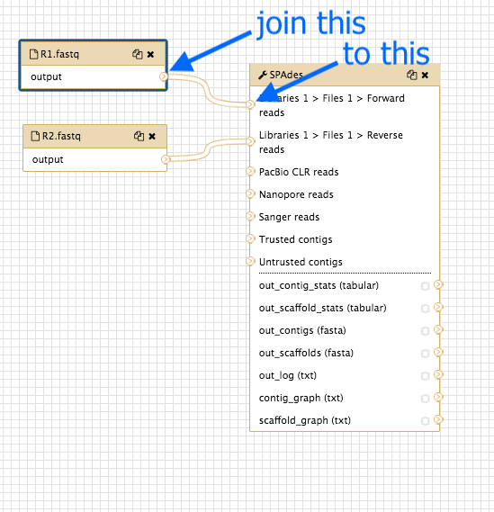
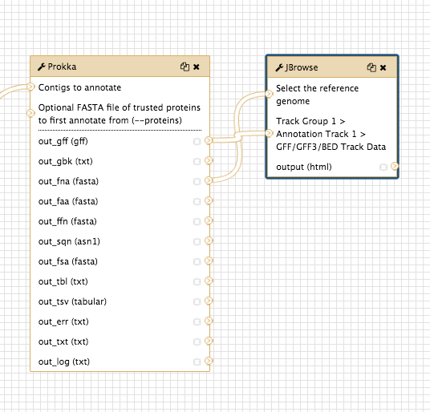
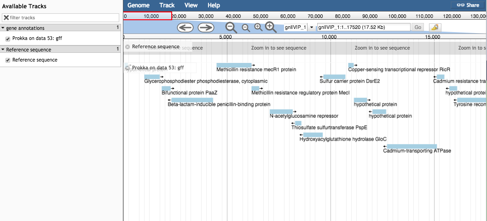

# Galaxy workflows

A workflow is a chain of analysis steps. In Galaxy, we can create a workflow from an existing analysis history, or we can create one visually by adding tools to a canvas.

This tutorial covers building a workflow to analyse a bacterial genome, from input FASTQ sequencing reads to assembly, annotation, and visualization.

<fn>**New to Galaxy?** First try the [introduction](../galaxy/index.md) and then learn some [key tasks](../intro/index.md)</fn>

## Start

Log in to your Galaxy instance (for example, Galaxy Australia, [usegalaxy.org.au](https://usegalaxy.org.au/)).

Import a history of data files:

- Click on the <ss>History</ss> cog 
- Select <ss>Import from File</ss>
- In the box called <ss>Archived History URL</ss>, paste in this link address to the Galaxy history of input files:

<tt>https://swift.rc.nectar.org.au:8888/v1/AUTH_377/public/Microbial_tutorials/Galaxy_history_input_files.tar.gz</tt>

- Click <ss>Import History</ss>
- Wait a few seconds.
- Click on the "View all histories" button 
- See if the Galaxy history has been imported: it will be called <fn>imported from archive: Data</fn>
- Above that pane, click on the <ss>Switch to</ss> button.
- Then click <ss>Analyze Data</ss> (in the top menu bar).
- You should now have a list of five files in your current history.

- Re-name this history "Workflows".

## Build a workflow

We will first write a workflow for genome assembly.

- In the top menu bar in Galaxy, click on "Workflow".

- Click on the plus button.

- Under <ss>Workflow Name:</ss> put in "Reads to Annotation".

- Click <ss>Save</ss>

- This will bring up the "Workflow Canvas", a grid where you can arrange the workflow.

### Add inputs

- In the Tools panel, click <ss>Inputs: Input datset</ss> twice (at the very top of the list).

- A box will appear: drag it to the left and there will be another box underneath it. Drag this also to the left. Your workflow canvas should look like this:

- Click on the first box. Look in the right hand panel (now called "Details"). Under <ss>Label</ss> type in <fn>R1.fastq</fn>. Press Enter for the change to be saved.

- Repeat for the second input dataset box, naming that one <fn>R2.fastq</fn>.

### Add the tool "spades"

- In the tools panel, search for <ss>spades</ss> and click on the tool name.
This puts the spades box onto the workflow canvas.

- Click on the spades box and look in the Details pane on the right. This shows all the options in spades. Choose:

- <ss>Run only Assembly</ss>: *Yes* [the *Yes* button should be darker grey]
- <ss>Kmers to use separated by commas:</ss> *33,55,91*  [note: no spaces]  
- <ss>Coverage cutoff:</ss> *auto*  

### Join inputs to the tool

Now tell spades which input files to use.

- Look at the input dataset box called <fn>R1.fastq</fn> and find the small arrow: >

- Click on this and drag the arrow over to the spades box input arrow > next to "Libraries 1 > Files 1 > Forward reads".

- Repeat for the dataset box <fn>R2.fastq</fn>, joining to the spades box next to "Libraries 1 > Files 1 > Reverse reads".

### Save it and run

- Click on the cog at the top right of the workflow canvas and "Save".
- Click the cog again and choose "Run".
- This brings up a window where you specify the input datasets to use in the workflow.

    - Under <ss>Step1: Input dataset</ss> choose <fn>mutant_R1.fastq</fn>.
    - Under <ss>Step2: Input dataset</ss> choose <fn>mutant_R2.fastq</fn>.

- Click <ss>Run workflow</ss>.

This will run the workflow (spades) and save the output to the top of your current history in the right hand panel.

- View some of the output files with the eye icon to check that the workflow (in this case, just spades) ran correctly.

## Add to the worfklow

We will add another tool to the workflow.

- Go to the top Galaxy panel and click "Workflow".

- Your workflow <fn>Reads to Annotation</fn> should be in the list. Click on the drop-down arrow next to this workflow and choose <ss>Edit</ss>.

- This will bring up the Workflow Canvas where we can add more inputs and tools.

- In the Tools panel search for <ss>Prokka</ss> and click on the tool name. This will add a Prokka box to the workflow canvas.

- We need to tell Prokka which genome assembly) to annotate. Join the spades output called <fn>out_contigs(fasta)</fn> to the Prokka input called <fn>Contigs to annotate</fn>.

- Click on the Prokka box and change some of the settings in the right hand Details panel:

    - Set the following parameters (leave everything else unchanged):
    - <ss>Locus tag prefix (--locustag)</ss>: P
    - <ss>Force GenBank/ENA/DDJB compliance (--compliant)</ss>: *No*
    - <ss>Sequencing Centre ID (--centre)</ss>: V
    - <ss>Use genus-specific BLAST database</ss> *No*  

- Click on the cog to the top right of the workflow canvas to save.

- Click on the cog again to run.

    - Again, choose the input files: <fn>mutant_R1.fastq</fn> and <fn>mutant_R2.fastq</fn>, and then click <ss>Run workflow</ss>.

- The output from the workflow (files from spades and prokka) will appear at the top of the History panel.

- Click on the eye icon for some files to verify the workflow ran correctly.      

## Add more to the workflow

We will add a visualization tool to view the genome annotation.

- Go to the top Galaxy panel and click "Workflow".

- Your workflow <fn>Reads to Annotation</fn> should be in the list. Click on the drop-down arrow next to this workflow and choose <ss>Edit</ss>.

- This will bring up the Workflow Canvas where we can add more inputs and tools.

- In the Tools panel, search for <ss>JBrowse</ss> and click on *JBrowse genome browser*. This will add a JBrowse box to the workflow canvas.

- Click on the JBrowse box. In the Details pane:

    - Under <ss>Reference genome to display</ss> choose *Use a genome from history*.
    - For <ss>Produce a Standalone Instance</ss> select *Yes*.

    - For <ss>Genetic Code</ss> choose *11: The Bacterial, Archaeal and Plant Plastid Code*.
    - Under <ss>JBrowse-in-Galaxy Action</ss> choose *New JBrowse Instance*.

    - Click <ss>Insert Track Group</ss>

    - Under <ss>Track Category</ss> type in *gene annotations*.

    - Click <ss>Insert Annotation Track</ss>

    - For <ss>Track Type</ss> choose *GFF/GFF3/BED/GBK Features*

    - Under <ss>JBrowse Track Type[Advanced]</ss> select *Canvas Features*.

    - Under <ss>Track Visibility</ss> choose *On for new users*.

- Now we need to tell JBrowse the input files to use.

    - Join the Prokka output <fn>out_fna (fasta)</fn> to the JBrowse input <fn>Select the reference genome</fn>

    - Join the Prokka output <fn>out_gff (gff)</fn> to the JBrowse input <fn>Track Group 1...</fn>

- Click on the cog to save; again to run; choose input files; <ss>Run workflow</ss>; examine output files in current history.

- The workflow will now assemble and annotate the genome, and create a JBrowse view of the annotations.

- JBrowse will produce one output file.

    - Click on the eye icon to view.
    - In the centre drop down box, choose contig 1.
    - Under "Available Tracks" on the left, tick the boxes.
    - Zoom in and out with the plus and minus icons.
    - The blue blocks are the genome annotations.

<!--  ## Extension section

Create a new workflow for variant calling.
- inputs:
- tools:
- jbrowse:

-->

## Summary

- Our workflow is now:

    - <fn>FASTQ</fn> sequence reads to Spades for assembly
    - Spades <fn>contigs fasta file</fn> to Prokka for annotation
    - Prokka <fn>fasta file</fn> and <fn>.gff file</fn> to JBrowse for visualisation.

- We can re-run this workflow with different input FASTQ files.

## Other workflow options

### Saving outputs

To save only some output files:

- Go to the workflow canvas.
- Find the star next to the outputs.
- Click on the star for any outputs you want to save.

To save these starred files from the workflow output as a new history:

- Before you click <ss>Run workflow</ss>, tick the box above to <ss>Send results to a new history</ss>.

###Import a workflow

To import an existing Galaxy Workflow:

- Go to the Workflow tab in the top panel.
- At the top right, click on <ss>Upload or import workflow</ss>.

###Extract a workflow

You can extract a workflow from an existing Galaxy history.

- Go to your Galaxy history
- Click on the History cog icon and choose "Extract Workflow".
- Give it a name and click <ss>Create Workflow</ss>.
- To edit, go to the Workflow tab, select the workflow, and choose "Edit" from the drop down menu. You can then edit the steps on the Workflow Canvas.

### A note on workflow tabs

We have been using the top Workflow tab. There is another tab at the bottom of the tool panel called Workflows. Click on <ss>Workflows: All Workflows</ss>. This gives a similar view with a list of workflows.

To return to the main Galaxy window click on the <ss>Analyze Data</ss> tab in the top panel.

## What's next?

To use the tutorials on this website:

* &#8592; see the list in the left hand panel
* &#8598; or, click the **menu button** (three horizontal bars) in the top left of the page

You can find more tutorials at the Galaxy Training Network:

* [http://galaxyproject.github.io/training-material/](http://galaxyproject.github.io/training-material/)
